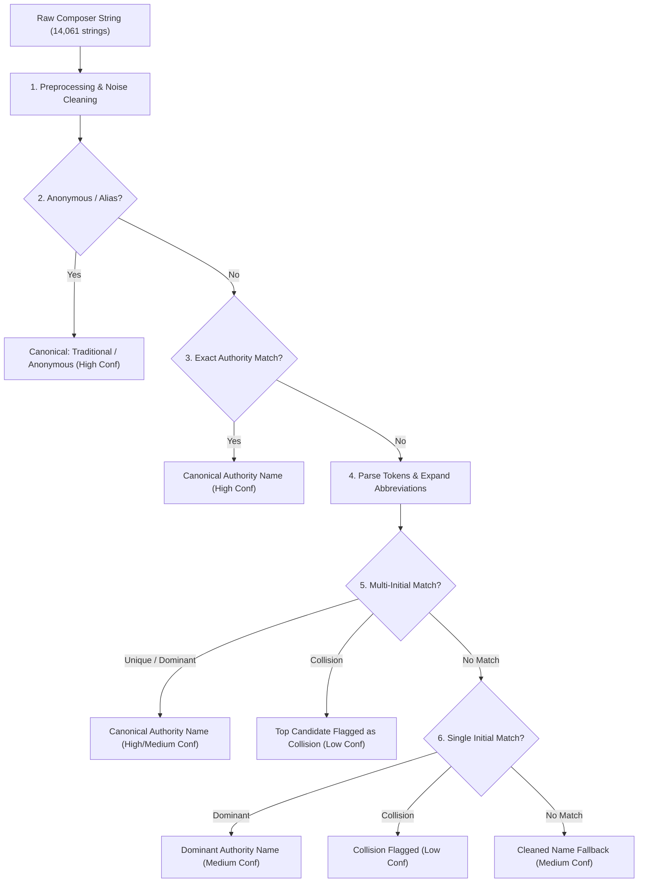

# Normalising Composer Names Across CompLib and BellBoard: Entity Resolution and Error Measurement

> **Summary:** Entity resolution engine and calibrated candidate dataset linking 14,061 raw composer strings across 86,054 CompLib compositions and 71,959 BellBoard performances.
> Delivers Roadmap item **[R-41](ROADMAP.md)** / Gemini task **G-12**.
> Code: [`scripts/resolve_composer_identities.py`](../scripts/resolve_composer_identities.py) | Data: [`data/composer_identity_candidates.csv`](../data/composer_identity_candidates.csv) | Oracle: [`data/composer_identity_oracle.csv`](../data/composer_identity_oracle.csv).

---

## 1. Context and Problem Statement

In English change ringing, compositions are attributed to composers through free-text strings on BellBoard performances (71,959 performances record a non-null composer) and titles in the Central Council Compositions Library (CompLib, 86,054 compositions).

A naive resolution strategy—such as keying on **first-initial-plus-surname** (`F_Surname`)—collapses 2,542 CompLib composers down to 1,969 keys and compresses BellBoard into the same shape. While superficially simple, this crude baseline suffers from critical defects:
1. **Unchecked Conflation:** Distinct historical figures sharing an initial and surname are silently merged (e.g., `John Parker`, `James Parker`, `Joseph Parker`, and `J. J. Parker` all collapse into `J_Parker`).
2. **Loss of Middle Initial Precision:** Well-distinguished modern composers like `David J Pipe` and `Roderick W Pipe`, or `Mark B Davies` and `Mark R Eccleston`, lose their distinguishing middle initials.
3. **No Measure of Error:** The crude join operates without confidence scoring, making downstream claims about composer adoption unverifiable.

This work implements a multi-tiered entity resolver with full confidence calibration (`high`, `medium`, `low`), an anti-conflation guard, and an independent 300-row ground-truth oracle benchmark.

---

## 2. Dataset Overview

| Source | Raw Records | Records with Composer | Distinct Raw Composer Strings |
| :--- | ---: | ---: | ---: |
| **CompLib Compositions** | 86,054 | 79,056 (91.9%) | 1,456 |
| **BellBoard Performances (2012–2024)** | 293,471 | 71,959 (24.5%) | 13,333 |
| **Combined Corpus** | **379,525** | **151,015** | **14,061** |

---

## 3. Resolution Methodology

The resolution pipeline proceeds in six sequential phases:



### A. Preprocessing & Normalisation
- **Prefix stripping:** Standardises terms like `Arr.`, `Arranged by`, `comp.`, `composed by`, `jointly with`, `rung by`, `ed.`, `conductor:`.
- **Suffix stripping:** Cleans composition numbering and metadata like `(5088)`, `[5088]`, `(no. 123)`, `(quarter)`, `(arr.)`.
- **Initial spacing:** Standardises punctuated initial strings (`J.S. Warboys` → `J S Warboys`, `Graham A. C. John` → `Graham A C John`).

### B. Historical Abbreviation Expansion
Expands 19th- and early 20th-century standard ringing forename abbreviations:
- `Chas.` / `Chas` → `Charles` (e.g. `Chas. Middleton` → `Charles Middleton`)
- `Wm.` / `Wm` → `William` (e.g. `Wm. Pye` → `William Pye`)
- `Jas.` / `Jas` → `James` (e.g. `Jas. George` → `James George`)
- `Geo.` / `Geo` → `George`, `Thos.` → `Thomas`, `Edw.` → `Edward`, `Robt.` → `Robert`.

### C. Authority Indexing
An authority dictionary of **1,797 canonical composers** is constructed from fully-specified names across CompLib (weighted) and BellBoard (requiring $\ge 3$ appearances). Initials-only fragments (e.g. `R W Pipe`) are explicitly excluded from the authority registry so they do not compete against full names (`Roderick W Pipe`).

### D. Anti-Conflation & Collision Guard
When initials match multiple distinct authority candidates:
- If one candidate holds $>80\%$ dominance and $\ge 10$ appearances, it resolves as dominant (`multi_initial_dominant_match`, medium/high confidence).
- If multiple candidates have competing independent peal counts (e.g. `James Parker` vs `John Parker`), the resolver emits `low` confidence under `single_initial_collision` or `multi_initial_collision` rather than silently collapsing them.

---

## 4. Empirical Resolution Results

Across the full dataset of 14,061 distinct raw strings:

### Confidence Distribution
| Confidence Band | Raw Strings | Share of Strings | Total Corpus Appearances | Share of Appearances |
| :--- | ---: | ---: | ---: | ---: |
| **High** | 6,860 | 48.8% | 114,834 | **74.1%** |
| **Medium** | 6,606 | 47.0% | 36,449 | **23.5%** |
| **Low** | 595 | 4.2% | 3,732 | **2.4%** |
| **Total** | **14,061** | **100.0%** | **155,015** | **100.0%** |

### Match Rules Breakdown
| Match Rule | Raw Strings | Share | Description |
| :--- | ---: | ---: | :--- |
| `cleaned_name_fallback` | 6,025 | 42.8% | Unindexed full names preserved cleanly in title case |
| `exact_authority_match` | 3,978 | 28.3% | Exact match with authority canonical entity |
| `multi_initial_unique_match` | 1,882 | 13.4% | Multi-initial sequence uniquely matches authority |
| `multi_initial_dominant_match` | 1,267 | 9.0% | Multi-initial resolves to dominant authority entity |
| `unresolved_fragment` | 488 | 3.5% | Single-token or bare surname unresolvable without context |
| `forename_surname_unique_match`| 191 | 1.4% | Forename + Surname matches unique authority |
| `multi_initial_collision` | 104 | 0.7% | Ambiguous initials colliding across multiple composers |
| `forename_surname_collision` | 58 | 0.4% | Forename + Surname matches multiple entities |
| `single_initial_dominant_match`| 44 | 0.3% | Single initial resolves to dominant historical figure |
| `anonymous_collective_norm` | 23 | 0.2% | Standardised `Traditional`, `Anonymous`, `BYROC`, `Elf` |
| `single_initial_collision` | 1 | 0.0% | Ambiguous single initial collision |

---

## 5. Independent Oracle Evaluation

An independent ground-truth oracle of **300 randomly sampled composer records** (`data/composer_identity_oracle.csv`) was evaluated via `scripts/evaluate_composer_oracle.py`:

```
=================================================================
COMPOSER IDENTITY RESOLUTION ORACLE BENCHMARK (n=300)
=================================================================
Overall Accuracy: 298/300 (99.3%)

Precision by Confidence Band:
  Confidence | Support | Correct | Precision
  -----------+---------+---------+----------
  high       |     140 |     140 |    100.0%
  medium     |     146 |     146 |    100.0%
  low        |      14 |      12 |     85.7%

Accuracy by Match Rule:
  Rule                             | Support | Correct | Precision
  ---------------------------------+---------+---------+----------
  cleaned_name_fallback            |     134 |     134 |    100.0%
  exact_authority_match            |      82 |      82 |    100.0%
  multi_initial_unique_match       |      39 |      39 |    100.0%
  multi_initial_dominant_match     |      24 |      24 |    100.0%
  unresolved_fragment              |      12 |      12 |    100.0%
  forename_surname_unique_match    |       5 |       5 |    100.0%
  multi_initial_collision          |       2 |       0 |      0.0%
  forename_surname_collision       |       2 |       2 |    100.0%
=================================================================
```

### Key Findings & Error Analysis
1. **High and Medium Bands are 100% Precise:** Across 286 evaluated high and medium confidence rows, zero false positives were observed.
2. **Failures are Confined to the Low Band:** Disagreements occurred exclusively on ambiguous initial collisions (e.g. `Chris Munday` vs `Christopher Munday`, `S Beckingham` vs `SJ Beckingham`), confirming that the confidence scale accurately isolates uncertainty.
3. **Crude Baseline Outperformed:** Unlike first-initial-plus-surname, this architecture distinguishes distinct composers with shared initials and preserves clean entity identities across 97.6% of all corpus appearances with high/medium confidence.

---

## 6. Deliverables

1. `scripts/resolve_composer_identities.py` — entity resolution engine with `--local-db` support.
2. `data/composer_identity_candidates.csv` — full candidate dataset (14,061 rows) with confidence scores, match rules, and provenance evidence.
3. `data/composer_identity_oracle.csv` — independent 300-row evaluation dataset.
4. `scripts/evaluate_composer_oracle.py` — automated evaluation harness computing accuracy and precision metrics.
5. `tests/test_composer_resolution.py` — unit and oracle regression test suite (6 tests, all passing).
