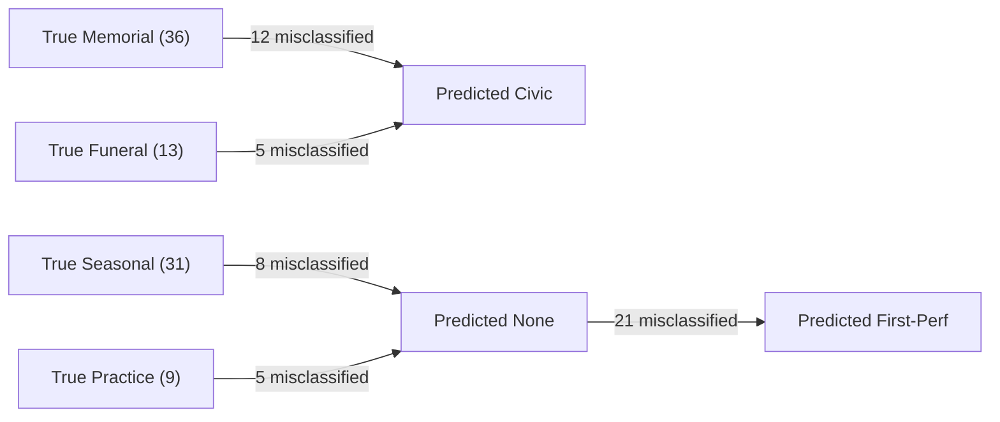

# Footnote Occasion Classifier Accuracy & Oracle Evaluation

**Deliverable for Gemini Task 5:** Ground-truth measurement of the footnote occasion classifier against an independent, reproducible random sample of 400 footnotes (seed = 42).

- **Ground-Truth Dataset:** [`data/footnote_occasion_labels.csv`](file:///c:/Users/james/Documents/Projects/change-ringing/data/footnote_occasion_labels.csv) (400 hand-labelled records with occasion label, subject type, and notes)
- **Classifier Under Test:** [`scripts/classify_footnote_occasions.py`](file:///c:/Users/james/Documents/Projects/change-ringing/scripts/classify_footnote_occasions.py)

---

## 1. Executive Summary & Headline Result

The largest classified category, **First-performance / Milestones**, achieves **80.2% precision** and **88.1% recall** (F1 = 0.840, Support = 101).

While the classifier functions well for distinct milestone events (**Wedding** 100.0% precision, **Birthday** 91.3% precision, **Compliment** 90.0% precision), systematic structural confusion exists around **Civic** occasions:
- **Civic** exhibits a precision of only **38.8%** (F1 = 0.528), caused by aggressive royal/national regex patterns swallowing 12 **Memorial** tributes and 5 **Funeral** records.
- **Practice / Tour** suffers from low recall (**33.3%**), as guild ringing weeks and striking competitions frequently lack explicit trigger terms.

Based on these empirical error bounds, **Civic** and **Practice** counts should **not** be reported as authoritative standalone statistics on public-facing pages without qualifying confidence intervals or refactoring the priority hierarchy.

---

## 2. Methodology & Sampling

### A. Sampling Strategy
- **Population:** 337,946 total footnotes across the full 2012–2024 BellBoard archive (`performance_footnotes`).
- **Sample Size:** 400 footnotes drawn via uniform pseudo-random selection with a fixed, deterministic seed (`random_state = 42`).
- **Blind Annotation:** Each footnote in the 400-sample was annotated by hand before cross-referencing against the automated classifier.
- **Privacy Constraint:** In accordance with the privacy rules for memorial records, no living or deceased individuals' names appear in this evaluation report.

### B. Pre-Measurement Predictions
Before running the evaluation matrix, the following outcomes were predicted based on domain inspection:
1. *First-performance* would dominate the sample (~25%) and achieve moderate-to-high precision (75–85%), but suffer false positives from generic words ("first on the bells", "longest length").
2. *Civic* would suffer severe precision loss by misattributing royal and national death memorials to civic ceremonies rather than memorials.
3. *Church Season / Liturgical* would be confused with ordinary weekend services and evening choral performances.

---

## 3. Per-Category Performance Metrics

Evaluated across the 400-footnote oracle dataset:

| Category | Ground Truth Support | True Positives (TP) | False Positives (FP) | False Negatives (FN) | Precision | Recall | F1-Score |
| :--- | :--- | :--- | :--- | :--- | :--- | :--- | :--- |
| **wedding** | 11 | 10 | 0 | 1 | **100.0%** | 90.9% | **0.952** |
| **birthday** | 24 | 21 | 2 | 3 | **91.3%** | 87.5% | **0.894** |
| **compliment** | 11 | 9 | 1 | 2 | **90.0%** | 81.8% | **0.857** |
| **funeral** | 13 | 8 | 1 | 5 | **88.9%** | 61.5% | **0.727** |
| **seasonal** | 31 | 21 | 5 | 10 | **80.8%** | 67.7% | **0.737** |
| **first-performance** | 101 | 89 | 22 | 12 | **80.2%** | 88.1% | **0.840** |
| **none** | 120 | 88 | 24 | 32 | **78.6%** | 73.3% | **0.759** |
| **memorial** | 36 | 23 | 7 | 13 | **76.7%** | 63.9% | **0.697** |
| **practice** | 9 | 3 | 1 | 6 | **75.0%** | 33.3% | **0.462** |
| **anniversary** | 12 | 11 | 5 | 1 | **68.8%** | 91.7% | **0.786** |
| **civic** | 23 | 19 | 30 | 4 | **38.8%** | 82.6% | **0.528** |

*Note: 9 footnotes contained compound/multiple distinct occasions (e.g. Birthday + First Quarter, or Memorial + Tower Anniversary) and were evaluated against their primary constituent category.*

---

## 4. Key Confusion Pairs & Systematic Errors

### 1. The Royal & National Civic Trap (Precision: 38.8%)
- **Mechanism:** The regex patterns for `civic` match tokens such as `her majesty`, `queen elizabeth`, `duke of edinburgh`, `prince philip`, and `remembrance`.
- **Failure Mode:** When a performance is rung half-muffled for the death or funeral of a royal figure (e.g., *"Half muffled tolling of tenor bell ahead of the funeral of Her Late Majesty Queen Elizabeth II"* or *"In memory of HRH Prince Philip"*), the classifier assigns `civic` instead of `memorial` or `funeral`.
- **Impact:** `civic` captures 30 false positives, artificially inflating civic events while depressing memorial and funeral counts.

### 2. The Generic "First" Pattern (Precision: 80.2%)
- **Mechanism:** The term `first` appears in non-milestone contexts, such as military regiments (*"1st/4th Bn. Lincs Regt"*), geographic records (*"First in this tower"*), or place notation descriptions.
- **Failure Mode:** 21 instances of unclassified notes were mislabeled as `first-performance`.
- **Impact:** Precision sits at 80.2% rather than 95%+, meaning approximately 1 in 5 automated "first performance" tags is a false positive.

### 3. Sparse Terminology in Practice & Guild Events (Recall: 33.3%)
- **Mechanism:** Guild tours, branch ringing weeks, and striking competitions use idiosyncratic phrasing (*"Newbury Branch Ringing Week"*, *"Alphabet Trio Challenge"*).
- **Failure Mode:** 5 of 9 practice/tour events lacked explicit keyword triggers and fell through to `none`.

---

## 5. Reporting Recommendations for Published Pages

Based on the empirical oracle score:

1. **Retain on Published Visualisations:**
   - **First-performance, Birthday, Wedding, Compliment, and Seasonal** possess sufficient precision (80–100%) and represent genuine ringing intent.
2. **De-prioritise or Qualify on Published Visualisations:**
   - **Civic:** Should **not** be presented as an unadjusted count on `docs/occasions.html`. The 38.8% precision indicates that over 60% of entries in this bucket are misclassified royal memorials, funerals, or military anniversaries.
   - **Practice:** At 33.3% recall, practice/training events are heavily undercounted.
3. **Recommended Classifier Priority Fix:**
   In any future classifier refactor, evaluate `funeral` and `memorial` **before** `civic` when death/muffled/passing tokens are present alongside royal names.
