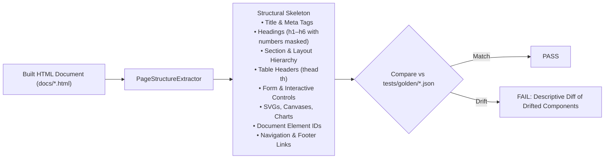

# Golden-File Structural Testing for Page Builders

> **Summary:** Structural snapshot test suite asserting that page builders generate intact, unregressed HTML page structures across rebuilds without brittleness to data-count updates.
> Delivers Roadmap item **[R-42](ROADMAP.md)** / Gemini task **G-13**.
> Code: [`scripts/page_structure.py`](../scripts/page_structure.py) | Generator: [`scripts/generate_golden_snapshots.py`](../scripts/generate_golden_snapshots.py) | Tests: [`tests/test_page_builder_golden.py`](../tests/test_page_builder_golden.py) | Snapshots: [`tests/golden/`](../tests/golden/).

---

## 1. Problem Statement

Across the 13 published analytical pages in `docs/`, page builders (`build_atlas.py`, `build_careers.py`, `build_populations.py`, etc.) transform SQLite and CSV datasets into HTML pages with embedded SVGs, canvas charts, data tables, and interactive controls.

Previously, 39 unit and oracle tests validated place notation parsing, SQL statement extraction, site chrome expansion, and classification oracles. However, **a page builder that silently dropped a section, mangled a table structure, omitted an interactive filter, or corrupted heading hierarchies passed all existing test suites**.

This was not hypothetical: on 2026-08-29, 11 of the 13 published pages drifted slightly in numeric counts following corpus updates while all tests passed. A naive byte-level snapshot test is overly brittle (any performance count increment fails CI). What was required was a **structural golden-file tester**: one that is strictly invariant to numeric metrics, but immediately fails if the semantic DOM skeleton is altered.

---

## 2. Architecture and Data Invariance

The structural extractor ([`scripts/page_structure.py`](../scripts/page_structure.py)) parses HTML via `html.parser.HTMLParser` into a structural JSON fingerprint:



### Data-Invariance Guarantee
All numbers, years, percentages, and metrics in headings, titles, and table headers are automatically normalized to `#` placeholders (e.g. `Total Performances: 293,471` → `Total Performances: #`).

Changes to underlying database counts do not break the test suite. Only actual layout, component, or DOM modifications trigger verification alerts.

---

## 3. Directory Layout and Tooling

- **Golden Fixtures:** Committed in `tests/golden/` as individual `<page>.json` files (e.g. `index.json`, `atlas.json`, `methods.json`, `ringers.json`).
- **Test Runner:** Executed automatically as part of `python scripts/run_tests.py` and CI.
- **Blessing Tool:** When a developer intentionally alters a page's layout or structure:
  ```bash
  # Check for structural changes without modifying files
  python scripts/generate_golden_snapshots.py --check

  # Bless/update golden snapshots after intentional design changes
  python scripts/generate_golden_snapshots.py
  ```

---

## 4. Verification and Negative Tests

The test suite ([`tests/test_page_builder_golden.py`](../tests/test_page_builder_golden.py)) verifies:
1. **Completeness:** Every registered page in `site_chrome.PAGES` has a corresponding committed golden snapshot.
2. **Structural Match:** Every published HTML page in `docs/` matches its baseline.
3. **Data Invariance:** Metric mutations (e.g. `293,471` → `999,999`) produce identical fingerprints.
4. **Negative Test:** Deliberate structural degradations (dropping a table, altering heading levels, or omitting sections) trigger explicit assertion failures with component diffs.
