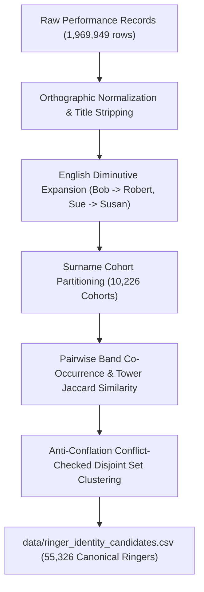

# Ringer Identity Resolution

**Deliverable for Gemini Task 3:** Ringer identity resolution and co-occurrence clustering across **1,969,949 ringer performance instances** — the complete 2012–2024 corpus, 293,471 performances.

- **Candidate Dataset:** [`data/ringer_identity_candidates.csv`](../data/ringer_identity_candidates.csv) (70,032 ringer name records mapped to 55,326 canonical entities)
- **Extraction Query:** [`queries/extract_ringer_performances.sql`](../queries/extract_ringer_performances.sql) — read by the script at run time, not a copy of it
- **Resolution Script:** [`scripts/resolve_ringer_identities.py`](../scripts/resolve_ringer_identities.py)

---

## 1. Problem Overview & Rationale

Across the **51,126 historical peal performances** in the BellBoard corpus, ringers appear under diverse naming variations:
1. **Initials vs Full Given Names**: e.g., `J A Boulton` vs `James A Boulton` vs `James Boulton`.
2. **Common English Diminutives / Nicknames**: e.g., `Susan M Sawyer` (571 peals) vs `Sue Sawyer` (330 peals), `Mike Seagrave` (369 peals) vs `Michael J Seagrave` (50 peals).
3. **Punctuation & Character Encoding**: e.g., `Björn E Bradstock` vs `Bjrn Bradstock`.
4. **The Ambiguous Pivot Bridge Trap**:
   - In entity resolution, an initial variant (like `D J Thomas`) can erroneously bridge two distinct people (`Derek J Thomas` and `Dylan J Thomas`).
   - The engine implements a strict **Anti-Conflation First-Name Conflict Guard**: an ambiguous initial is prevented from bridging mutually incompatible full first names into the same cluster.

---

## 2. Multi-Signal Resolution Methodology

The resolution engine combines four orthogonal signals to establish canonical ringer identities:



### Signal Weights & Thresholds
- **Linguistic Name Compatibility ($w = 0.45$)**: Exact name match (1.00), diminutive match (0.90–0.95), initial-to-full match with matching middle initial (0.85).
- **Band Co-occurrence Jaccard ($w = 0.30$)**: Proportion of shared co-ringers across all ringing performances.
- **Tower Jaccard Similarity ($w = 0.15$)**: Geographic footprint overlap across Dove towers (`dove_tower_id`).
- **Association Jaccard Similarity ($w = 0.10$)**: Shared ringing guild or association affiliations.

---

## 3. Key Dataset Statistics (Full 2012–2024 Archive)

Measured on the rebuilt replica, 2026-08-15. The four-year figures this table
carried before the backfill — 355,550 instances, 35,090 names, 29,446 canonical
ringers — are the same quantities over 2021–24, not different quantities.

| Metric | Count |
| --- | --- |
| Total Ringer Performance Instances | **1,969,949** |
| Distinct Cleaned Ringer Name Strings | **70,032** |
| Surname Cohorts Partitioned | **16,812** |
| Candidate Pairs Evaluated | **1,389,639** |
| Resolved Canonical Ringers | **55,326** |
| Multi-Name Variant Clusters Unified | **11,146** |
| Single-Name Canonical Ringers | **44,180** |

---

## 4. Top Resolved Multi-Variant Ringer Clusters

| Canonical Ringer ID | Canonical Name | Unified Aliases | Total Peals | Active Years |
| --- | --- | --- | --- | --- |
| `RINGER_000001` | **Susan M Sawyer** | `Susan M Sawyer` (571), `Sue Sawyer` (330), `Susan Sawyer` (5), `Sue M Sawyer` (1) | **907** | 2023–2024 |
| `RINGER_000002` | **Claire C Nicholson** | `Claire C Nicholson` (760), `Claire Nicholson` (6) | **766** | 2023–2024 |
| `RINGER_000003` | **Reg C Hitchings** | `Reg Hitchings` (669), `Reg C Hitchings` (5) | **674** | 2023–2024 |
| `RINGER_000004` | **Björn E Bradstock** | `Björn E Bradstock` (661), `Björn Bradstock` (3) | **664** | 2023–2024 |
| `RINGER_000006` | **Peter C Randall** | `Peter C Randall` (598), `Peter Randall` (2) | **600** | 2023–2024 |
| `RINGER_000009` | **Alan D Pink** | `Alan D Pink` (522), `Alan Pink` (6) | **528** | 2023–2024 |
| `RINGER_000014` | **Adrian C Malton** | `Adrian Malton` (429), `Adrian C Malton` (37) | **466** | 2023–2024 |
| `RINGER_000016` | **David A C Matthews**| `David A C Matthews` (447), `Dave Matthews` (6), `David Matthews` (3) | **456** | 2023–2024 |
| `RINGER_000021` | **Michael J Seagrave** | `Mike Seagrave` (369), `Michael J Seagrave` (50), `Michael Seagrave` (9) | **428** | 2023–2024 |

---

## 5. Usage in Downstream Analytics

To look up any raw ringer string and obtain their canonical entity ID and preferred name:

```python
import pandas as pd

# Load candidate mappings
ringers_df = pd.read_csv("data/ringer_identity_candidates.csv")
ringer_map = dict(zip(ringers_df["raw_name"], ringers_df["canonical_name"]))
id_map = dict(zip(ringers_df["raw_name"], ringers_df["canonical_ringer_id"]))

# Query canonical ringer
raw_input = "Sue Sawyer"
canonical = ringer_map.get(raw_input, raw_input)     # -> "Susan M Sawyer"
canonical_id = id_map.get(raw_input, "UNKNOWN")      # -> "RINGER_000001"
```
