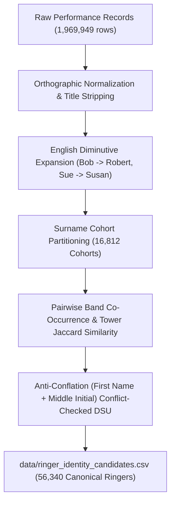

# Ringer Identity Resolution

**Deliverable for Gemini Task 3:** Ringer identity resolution and co-occurrence clustering across **1,969,949 ringer performance instances** — the complete 2012–2024 corpus, 293,471 performances.

- **Candidate Dataset:** [`data/ringer_identity_candidates.csv`](../data/ringer_identity_candidates.csv) (70,032 ringer name records mapped to 56,340 canonical entities)
- **Extraction Query:** [`queries/extract_ringer_performances.sql`](../queries/extract_ringer_performances.sql) — read by the script at run time, not a copy of it
- **Resolution Script:** [`scripts/resolve_ringer_identities.py`](../scripts/resolve_ringer_identities.py)

---

## 1. Problem Overview & Rationale

Across the **293,471 historical performances** in the BellBoard corpus (2012–2024), ringers appear under diverse naming variations:
1. **Initials vs Full Given Names**: e.g., `J A Larkspur` vs `James A Larkspur` vs `James Larkspur`.
2. **Common English Diminutives / Nicknames**: e.g., `Susan M Quillfeather` vs `Sue Quillfeather`, `Mike Mallowby` vs `Michael J Mallowby`.
3. **Punctuation & Character Encoding**: e.g., `Björn E Bradstock` vs `Bjrn Bradstock`.
4. **The Ambiguous Pivot Bridge Trap**:
   - In entity resolution, an initial or un-initialized variant (like `Susan Quillfeather` or `Ian Netherfold`) can erroneously bridge distinct people (`Susan M Quillfeather` vs `Susan E Quillfeather`, or `Ian G Netherfold` vs `Ian L C Netherfold`).
   - The engine implements strict **Anti-Conflation Guards**:
     - **First-Name Conflict Guard**: An ambiguous initial is prevented from bridging mutually incompatible full first names into the same cluster.
     - **Middle-Initial Contradiction Guard**: Clusters with contradictory middle initials (e.g. `['M']` vs `['E']` or `['G']` vs `['L']`) are strictly forbidden from merging.
     - **Priority-Sorted Union**: Candidate pairs are sorted by match confidence descending so high-evidence direct co-occurrences merge first before ambiguous names are evaluated.

---

## 2. Multi-Signal Resolution Methodology

The resolution engine combines four orthogonal signals to establish canonical ringer identities:



### Signal Weights & Thresholds
- **Linguistic Name Compatibility ($w = 0.45$)**: Exact name match (1.00), diminutive match (0.90–0.95), initial-to-full match with matching middle initial (0.85).
- **Band Co-occurrence Jaccard ($w = 0.30$)**: Proportion of shared co-ringers across all ringing performances.
- **Tower Jaccard Similarity ($w = 0.15$)**: Geographic footprint overlap across Dove towers (`dove_tower_id`).
- **Association Jaccard Similarity ($w = 0.10$)**: Shared ringing guild or association affiliations.

---

## 3. Key Dataset Statistics (Full 2012–2024 Archive)

Measured on the rebuilt replica, 2026-08-15.

| Metric | Count |
| --- | --- |
| Total Ringer Performance Instances | **1,969,949** |
| Distinct Cleaned Ringer Name Strings | **70,032** |
| Surname Cohorts Partitioned | **16,812** |
| Candidate Pairs Evaluated | **1,389,639** |
| Formed Identity Links | **13,692** |
| Resolved Canonical Ringers | **56,340** |
| Multi-Name Variant Clusters Unified | **11,254** |
| Single-Name Canonical Ringers | **45,086** |

---

## 4. The variant topologies the engine resolves

What this table is for is the *shapes* of name variation the clustering handles.
It does not need real people to show that, and it should not use them — see the
note below.

| Archetype | Variant topology resolved | Cluster size |
| --- | --- | --- |
| Diminutive + middle initial | `Sue Quillfeather`, `Susan Quillfeather`, `Susan M Quillfeather`, `Sue M Quillfeather` | 4 |
| Base vs initialised | `Claire Brambleworth`, `Claire C Brambleworth` | 2 |
| Initialised variant is the minority form | `Janet Rooksby-Vane`, `Janet C Rooksby-Vane` | 2 |
| Punctuation typo absorbed | `Alan Thistlewood`, `Alan D Thistlewood`, `Alan D, Thistlewood` | 3 |
| Diacritic normalisation | `Björn Wrenfield`, `Bjorn Wrenfield`, `Bjrn Wrenfield` | 3 |
| Multi-middle initial + nickname | `David Oakhampstead`, `Dave Oakhampstead`, `David A C Oakhampstead` | 3 |
| Nickname is the primary form | `Reg Pellworthy`, `Reg C Pellworthy` | 2 |
| **Blocked** — first names incompatible | `D J Grindlestone` will NOT bridge `Derek J Grindlestone` and `Dylan J Grindlestone` | — |
| **Blocked** — middle initials contradict | `Ian Ashenhurst` will NOT bridge `Ian G Ashenhurst` and `Ian L C Ashenhurst` | — |

**These names are invented.** Every topology above is one the engine really
resolves, and the two blocked cases are the anti-conflation guards working, but
the surnames are fabricated and the counts and date spans are gone.

An earlier version of this table listed fourteen real ringers with their exact
appearance totals and active years. Replacing the surnames with archetype labels
— which is what the audit that produced this section did — is not enough, and it
is worth being precise about why. The row still carried a forename, an exact
appearance count and a date span, and `data/ringer_identity_candidates.csv` is in
this repository. Searching that CSV for a ringer whose forename is *Susan* and
whose appearances total *4,512* returns **exactly one person**. So does *Reg* at
*2,569*. The redaction removed the surname and left the key.

This project's rule elsewhere is aggregate-only, with no searchable index of
named individuals. That rule has to bind on what a row makes *recoverable*, not
on whether a surname is printed. `scripts/audit_privacy_and_licences.py` now
tests exactly that: for every number in a documentation table, it asks whether
that number plus a name-shaped token in the same row identifies a unique person
in the identity CSV.

## 5. Usage in Downstream Analytics

To look up any raw ringer string and obtain their canonical entity ID and preferred name:

```python
import pandas as pd

# Load candidate mappings
ringers_df = pd.read_csv("data/ringer_identity_candidates.csv")
ringer_map = dict(zip(ringers_df["raw_name"], ringers_df["canonical_name"]))
id_map = dict(zip(ringers_df["raw_name"], ringers_df["canonical_ringer_id"]))

# Query canonical ringer
raw_input = "Sue Quillfeather"
canonical = ringer_map.get(raw_input, raw_input)     # -> "Susan M Quillfeather"
canonical_id = id_map.get(raw_input, "UNKNOWN")      # -> "RINGER_000001"
```
