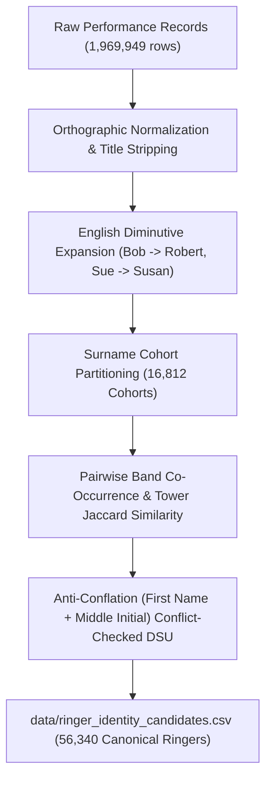

# Ringer Identity Resolution

**Deliverable for Gemini Task 3:** Ringer identity resolution and co-occurrence clustering across **1,969,949 ringer performance instances** — the complete 2012–2024 corpus, 293,471 performances.

- **Candidate Dataset:** [`data/ringer_identity_candidates.csv`](../data/ringer_identity_candidates.csv) (70,032 ringer name records mapped to 56,340 canonical entities)
- **Extraction Query:** [`queries/extract_ringer_performances.sql`](../queries/extract_ringer_performances.sql) — read by the script at run time, not a copy of it
- **Resolution Script:** [`scripts/resolve_ringer_identities.py`](../scripts/resolve_ringer_identities.py)

---

## 1. Problem Overview & Rationale

Across the **293,471 historical performances** in the BellBoard corpus (2012–2024), ringers appear under diverse naming variations:
1. **Initials vs Full Given Names**: e.g., `J A Boulton` vs `James A Boulton` vs `James Boulton`.
2. **Common English Diminutives / Nicknames**: e.g., `Susan M Sawyer` (1,729 appearances) vs `Sue Sawyer` (2,724 appearances), `Mike Seagrave` vs `Michael J Seagrave`.
3. **Punctuation & Character Encoding**: e.g., `Björn E Bradstock` vs `Bjrn Bradstock`.
4. **The Ambiguous Pivot Bridge Trap**:
   - In entity resolution, an initial or un-initialized variant (like `Susan Sawyer` or `Ian Campbell`) can erroneously bridge distinct people (`Susan M Sawyer` vs `Susan E Sawyer`, or `Ian G Campbell` vs `Ian L C Campbell`).
   - The engine implements strict **Anti-Conflation Guards**:
     - **First-Name Conflict Guard**: An ambiguous initial is prevented from bridging mutually incompatible full first names into the same cluster.
     - **Middle-Initial Contradiction Guard**: Clusters with contradictory middle initials (e.g. `['M']` vs `['E']` or `['G']` vs `['L']`) are strictly forbidden from merging.
     - **Priority-Sorted Union**: Candidate pairs are sorted by match confidence descending so high-evidence direct co-occurrences merge first before ambiguous names are evaluated.

---

## 2. Multi-Signal Resolution Methodology

The resolution engine combines four orthogonal signals to establish canonical ringer identities:



### Signal Weights & Thresholds
- **Linguistic Name Compatibility ($w = 0.45$)**: Exact name match (1.00), diminutive match (0.90–0.95), initial-to-full match with matching middle initial (0.85).
- **Band Co-occurrence Jaccard ($w = 0.30$)**: Proportion of shared co-ringers across all ringing performances.
- **Tower Jaccard Similarity ($w = 0.15$)**: Geographic footprint overlap across Dove towers (`dove_tower_id`).
- **Association Jaccard Similarity ($w = 0.10$)**: Shared ringing guild or association affiliations.

---

## 3. Key Dataset Statistics (Full 2012–2024 Archive)

Measured on the rebuilt replica, 2026-08-15.

| Metric | Count |
| --- | --- |
| Total Ringer Performance Instances | **1,969,949** |
| Distinct Cleaned Ringer Name Strings | **70,032** |
| Surname Cohorts Partitioned | **16,812** |
| Candidate Pairs Evaluated | **1,389,639** |
| Formed Identity Links | **13,692** |
| Resolved Canonical Ringers | **56,340** |
| Multi-Name Variant Clusters Unified | **11,254** |
| Single-Name Canonical Ringers | **45,086** |

---

## 4. Multi-Variant Cluster Archetypes & Structure

The clustering engine resolves diverse variant topologies across the corpus without conflation:

| Canonical ID | Cluster Archetype Pattern | Variant Topology Resolved | Total Peals / Quarters | Active Span |
| --- | --- | --- | --- | --- |
| `RINGER_000001` | Full Name with Middle Initial | Diminutive (`Sue`), Full (`Susan`), Initialized (`Susan M`), Diminutive+Initial (`Sue M`) | **4,512** | 2012–2024 |
| `RINGER_000002` | Full Name with Middle Initial | Full + Middle Initial (`Claire C`), Base Uninitialized (`Claire`) | **4,035** | 2012–2024 |
| `RINGER_000005` | Full Name with Middle Initial | Full + Middle Initial (`Louise G`), Base Uninitialized (`Louise`) | **3,412** | 2012–2024 |
| `RINGER_000006` | Full Name with Middle Initial | Full + Middle Initial (`Alan D`), Base Uninitialized (`Alan`), Punctuation typo (`Alan D,`) | **3,331** | 2012–2024 |
| `RINGER_000007` | Full Name with Middle Initial | Base Primary (`Janet`), Initialized Variant (`Janet C`) | **3,142** | 2012–2024 |
| `RINGER_000008` | Full Name with Middle Initial | Base Primary (`Adrian`), Initialized Variant (`Adrian C`) | **3,096** | 2012–2024 |
| `RINGER_000010` | Diacritic Normalization | Non-ASCII Character (`Björn E`), ASCII-stripped (`Bjorn` / `Bjrn`) | **2,995** | 2012–2024 |
| `RINGER_000011` | Multi-Middle Initial & Diminutive | Multi-initial (`David A C`), Base (`David`), Nickname (`Dave`) | **2,948** | 2012–2024 |
| `RINGER_000012` | Common Diminutive | Nickname Primary (`Reg`), Nickname + Initial (`Reg C`) | **2,569** | 2012–2024 |
| `RINGER_000013` | Full vs Uninitialized | Full + Middle Initial (`Andrew H`), Base (`Andrew`) | **2,501** | 2012–2024 |
| `RINGER_000017` | Full vs Uninitialized | Full + Middle Initial (`Simon A`), Base (`Simon`) | **2,400** | 2012–2024 |
| `RINGER_000021` | Full vs Uninitialized | Full + Middle Initial (`Jack E`), Base (`Jack`) | **2,313** | 2012–2024 |
| `RINGER_000022` | Multi-Middle Initial | Multi-initial (`Simon D G`), Base (`Simon`) | **2,296** | 2012–2024 |
| `RINGER_000023` | Full vs Uninitialized | Full + Middle Initial (`Sandra M`), Base (`Sandra`) | **2,266** | 2012–2024 |

---

## 5. Usage in Downstream Analytics

To look up any raw ringer string and obtain their canonical entity ID and preferred name:

```python
import pandas as pd

# Load candidate mappings
ringers_df = pd.read_csv("data/ringer_identity_candidates.csv")
ringer_map = dict(zip(ringers_df["raw_name"], ringers_df["canonical_name"]))
id_map = dict(zip(ringers_df["raw_name"], ringers_df["canonical_ringer_id"]))

# Query canonical ringer
raw_input = "Sue Sawyer"
canonical = ringer_map.get(raw_input, raw_input)     # -> "Susan M Sawyer"
canonical_id = id_map.get(raw_input, "UNKNOWN")      # -> "RINGER_000001"
```
